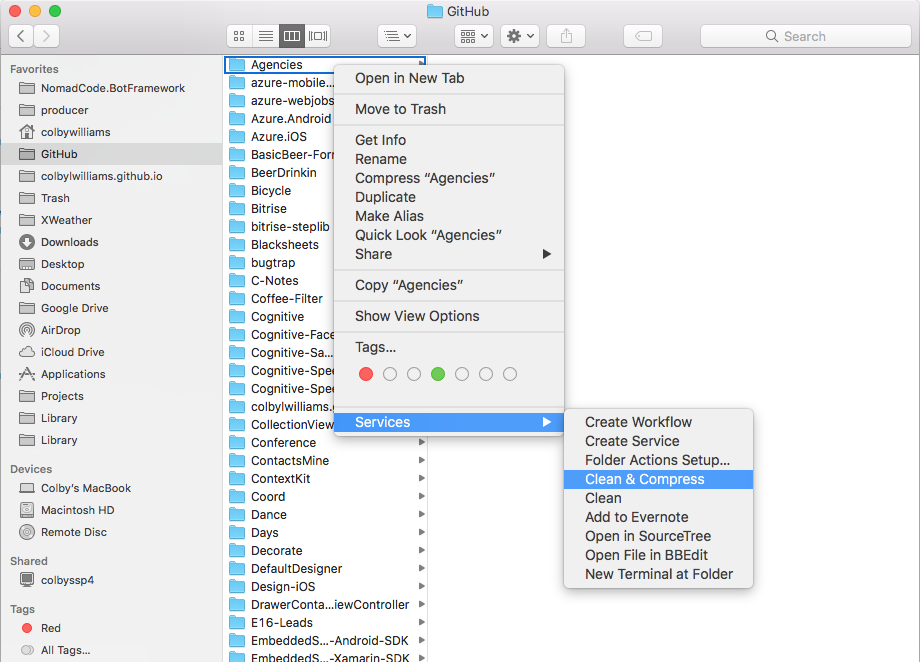

# clean-compress

A macOS utility that cleans (and optionally compresses/zips) Xamarin solutions

## Use

Download the latest .zip from [Releases](/releases) and decompress/uinzip the contents into: `~/Library/Services` (or `<Username>/Library/Services`)

This will add two nice little services to any directory(s) context menu:

*1)* `Clean` - blows away all `bin`, `obj`, `packages` directories recursively 

*2)* `Clean & Compress` - (useful for zipping up solutions to send) kills all the stuff that `Clean` does *AND* deletes `.userprefs` and compresses the directory *without* the `.git` folder (if there is one)

